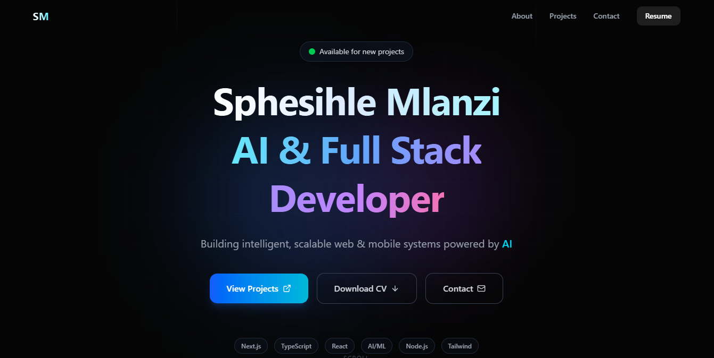
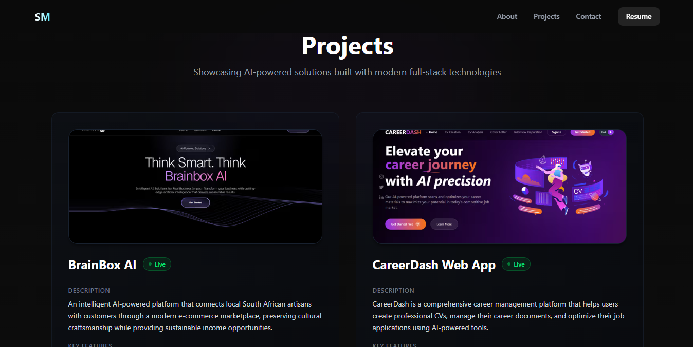
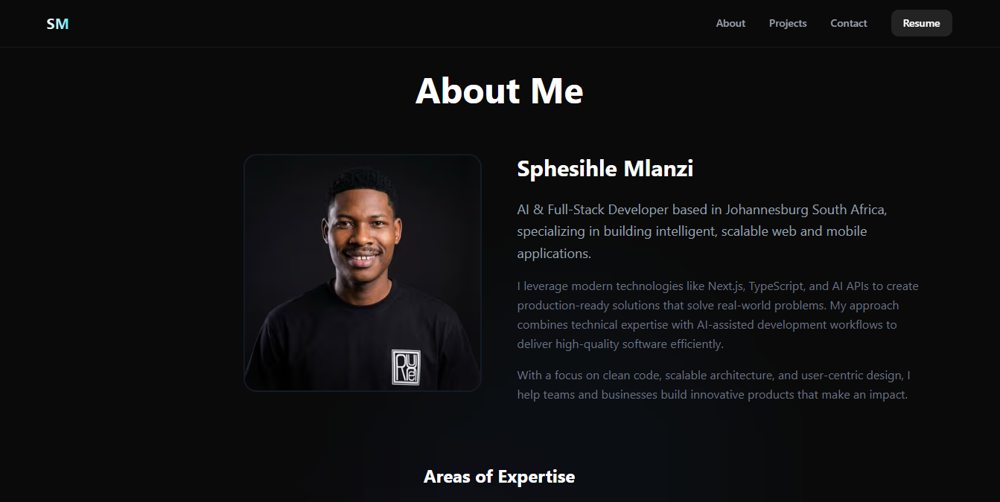

# AI Full-Stack Developer Portfolio

🌐 Live demo: https://spheaiportfolio.vercel.app/

This portfolio showcases my skills as a modern AI & Full-Stack Developer. It highlights clean UI, interactive AI demos, and real projects built with production-ready tooling.

## 🚀 Features

- Responsive, modern UI with Tailwind CSS  
- Built with Next.js (App Router) & TypeScript  
- Interactive AI components and API integration  
- Showcases real projects with live demos  
- Deployed on Vercel with fast performance

## 🛠 Tech Stack

- **Frontend:** Next.js, React, TypeScript  
- **Styling:** Tailwind CSS, Shadcn/UI  
- **Animations:** Framer Motion  
- **AI Integration:** OpenAI API / mock AI services  
- **Deployment:** Vercel  
- **Version control:** Git & GitHub

## 📁 Repositories

This repository contains the full code for my portfolio website including layout, interactive demos, and UI polish.

## 📱 Screenshots

### Home / Hero Section

### Projects Showcase

### About Section

## 📌 About Me

I’m an AI & Full-Stack Developer based in Johannesburg, building intelligent, scalable web and mobile systems.

Let’s connect on LinkedIn! 🚀
